# Telco Customer Churn — Applied Statistics Project

**Dataset:** IBM Telco Customer Churn (Kaggle / IBM Watson)  
**Course:** Applied Statistics — A.Y. 2025/2026  

---

## Table of Contents

1. [Dataset Description](#1-dataset-description)
2. [Exploratory Data Analysis](#2-exploratory-data-analysis)
3. [RQ1 — Churn Risk Factors & Retention Targeting](#3-rq1--churn-risk-factors--retention-targeting)
4. [RQ2 — Customer Segmentation & Churn Profiling](#4-rq2--customer-segmentation--churn-profiling)
5. [RQ3 — Service Pricing Structure](#5-rq3--service-pricing-structure)
6. [RQ4 — Decision Tree & Gradient Boosting](#6-rq4--decision-tree--gradient-boosting)
7. [RQ5 — Probabilistic Segmentation with GMM](#7-rq5--probabilistic-segmentation-with-gmm)
8. [Conclusions & Limitations](#8-conclusions--limitations)

---

## 1. Dataset Description

### 1.1 Overview

The dataset records service subscriptions, billing details, and churn status for **7,043 residential customers** of a California telecommunications company. It contains **21 variables** spanning demographics, contracted services, billing preferences, and the binary outcome `Churn` (whether the customer left within the last month).

### 1.2 Variable Table

| Variable | Type | Description / Values |
|---|---|---|
| `customerID` | ID | Unique customer identifier — dropped before modelling |
| `gender` | Binary categorical | Female / Male |
| `SeniorCitizen` | Binary (0/1) | Whether the customer is 65 or older |
| `Partner` | Binary categorical | Has a partner: Yes / No |
| `Dependents` | Binary categorical | Has dependents: Yes / No |
| `tenure` | Numeric (months) | Number of months the customer has been with the company (1–72) |
| `PhoneService` | Binary categorical | Has phone service: Yes / No |
| `MultipleLines` | 3-level categorical | No / Yes / No phone service |
| `InternetService` | 3-level categorical | DSL / Fiber optic / No |
| `OnlineSecurity` | 3-level categorical | No / Yes / No internet service |
| `OnlineBackup` | 3-level categorical | No / Yes / No internet service |
| `DeviceProtection` | 3-level categorical | No / Yes / No internet service |
| `TechSupport` | 3-level categorical | No / Yes / No internet service |
| `StreamingTV` | 3-level categorical | No / Yes / No internet service |
| `StreamingMovies` | 3-level categorical | No / Yes / No internet service |
| `Contract` | 3-level categorical | Month-to-month / One year / Two year |
| `PaperlessBilling` | Binary categorical | Yes / No |
| `PaymentMethod` | 4-level categorical | Bank transfer (automatic) / Credit card (automatic) / Electronic check / Mailed check |
| `MonthlyCharges` | Numeric (USD) | Current monthly bill (18.25–118.75) |
| `TotalCharges` | Numeric (USD) | Total amount charged over the entire tenure (≈ tenure × MonthlyCharges) |
| `Churn` | Binary target | Whether the customer left: Yes / No → encoded as 1 / 0 |

### 1.3 Numerical Summary

| Variable | Mean | Std | Min | Median | Max |
|---|---|---|---|---|---|
| `tenure` | 32.42 | 24.55 | 1 | 29 | 72 |
| `MonthlyCharges` | 64.80 | 30.09 | 18.25 | 70.35 | 118.75 |
| `TotalCharges` | 2283.30 | 2266.77 | 18.80 | 1397.48 | 8684.80 |

### 1.4 Data Cleaning

Three cleaning steps were applied before any analysis:

1. **`TotalCharges` type fix.** The column is stored as a string object. Eleven rows contain only whitespace (corresponding to customers with `tenure = 0`, i.e., recently onboarded). These were coerced to `NaN` via `pd.to_numeric(..., errors='coerce')` and dropped, leaving **7,032 rows**.

2. **`customerID` removed.** The identifier carries no predictive signal and was dropped to prevent accidental leakage.

3. **`Churn` encoded as 0/1.** The string values `"No"` / `"Yes"` were mapped to integers for compatibility with sklearn classifiers and metric functions.

After cleaning: **7,032 rows × 20 columns**. Overall churn rate: **26.6%** (1,869 churned customers).

> **Collinearity note.** `TotalCharges` correlates with `tenure × MonthlyCharges` at *r* = 0.9996. It is excluded from all regression and classification models to avoid near-perfect collinearity.

---

## 2. Exploratory Data Analysis

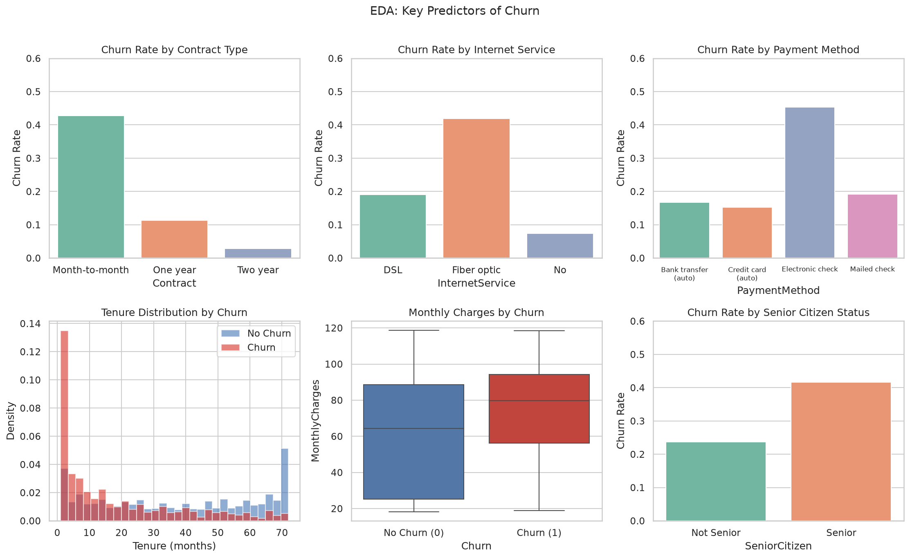

**Figure 1.** Six-panel EDA. Key observations:
- **Contract type** is the strongest univariate predictor: month-to-month customers churn at ~43%, versus ~11% (one year) and ~3% (two year).
- **Internet service** matters: fiber optic customers churn at ~42%, DSL customers at ~19%, and customers with no internet at ~7%. Fiber users pay more and may be comparing alternatives more actively.
- **Payment method:** electronic check users have the highest churn rate (~45%), possibly correlated with MTM contracts.
- **Tenure** shows a strong negative association with churn: most churners leave within the first 12–18 months.
- **Monthly charges** are higher on average for churners (~74 vs. ~61 USD).
- **Senior citizens** churn at ~42% vs. ~24% for non-seniors.

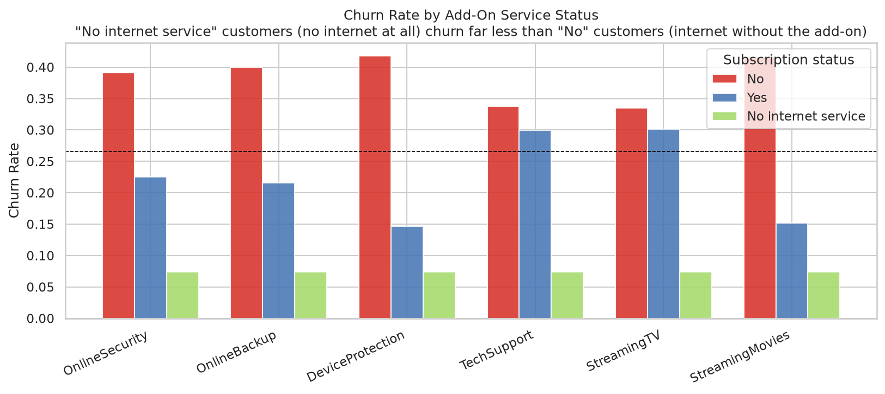

**Figure 2.** Customers without online security, tech support, or backup services churn at 2–3× the rate of customers who subscribe to these add-ons, suggesting these services increase perceived value and switching cost.

---

## 3. RQ1 — Churn Risk Factors & Retention Targeting

> *Which customer, service, and contract characteristics are most strongly associated with churn, and which levers should a telecom operator prioritize?*

**Method sequence:** A logistic regression baseline establishes interpretable odds ratios; Lasso (L1) regularization performs embedded feature selection; Random Forest provides a non-parametric benchmark and importance ranking. All models use a shared preprocessing pipeline (StandardScaler + OneHotEncoder inside ColumnTransformer) and a stratified 80/20 train/test split.

### 3.1 Preprocessing

Numerical predictors (`tenure`, `MonthlyCharges`) are standardized. All categorical predictors are one-hot encoded with `drop='first'` to avoid the dummy variable trap. Everything is inside a `Pipeline` so cross-validation folds only ever see information from their training portion — no leakage.

**Training set:** 5,625 observations (26.6% churn) | **Test set:** 1,407 observations (26.6% churn)

### 3.2 Logistic Regression Baseline

A baseline logistic regression with `class_weight='balanced'` (to compensate for the 26.6% minority class) achieves **test AUROC = 0.833**.

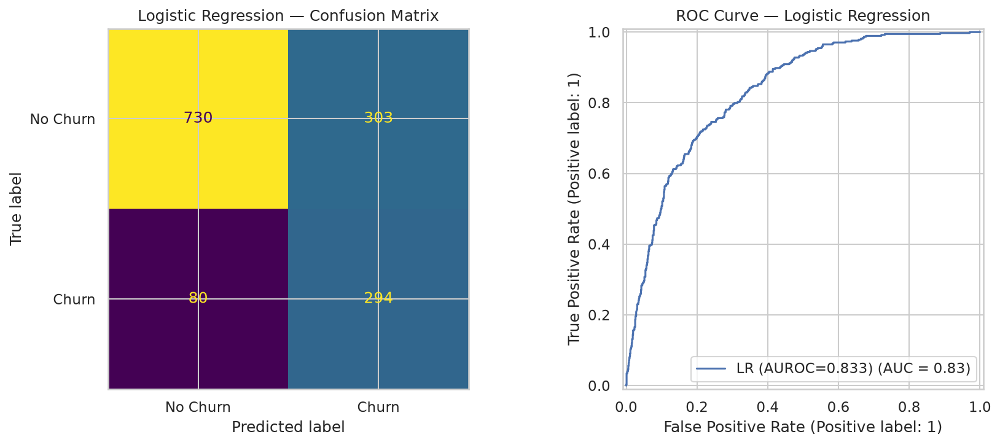

**Figure 3.** Confusion matrix (left) and ROC curve (right). With balanced weights, recall for churners is 0.78 at the cost of precision (0.49), reflecting the model's priority on catching churners rather than minimizing false positives.

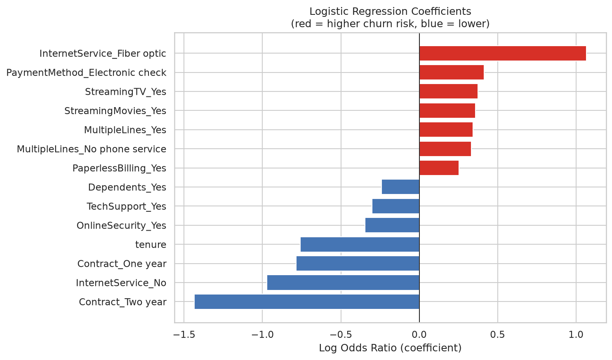

**Figure 4.** Exponentiated logistic regression coefficients (odds ratios) for all features. Values above 1 increase churn odds; values below 1 decrease them.

**Key odds ratios:**

| Feature | Direction | Interpretation |
|---|---|---|
| Contract_Two year | ↓↓ (OR ≪ 1) | Two-year contract is the strongest churn deterrent |
| Contract_One year | ↓ | One-year also substantially reduces churn odds |
| InternetService_Fiber optic | ↑↑ | Fiber customers have much higher churn odds than DSL |
| tenure | ↓↓ | Each additional standardized unit of tenure reduces churn |
| OnlineSecurity_Yes | ↓ | Subscribing to security reduces churn odds |
| PaymentMethod_Electronic check | ↑ | Electronic check associated with higher churn |
| SeniorCitizen_1 | ↑ | Senior citizens have elevated churn odds |

### 3.3 Lasso Feature Selection

L1-penalized logistic regression (using `l1_ratio=1.0, solver='saga'` — the sklearn ≥ 1.8 API for Lasso) with `C` tuned over a log-spaced grid via 5-fold stratified CV selects **best C = 0.2069** and achieves **test AUROC = 0.835**.

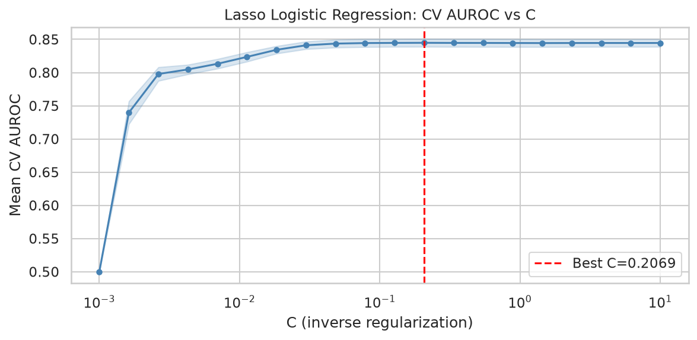

**Figure 5.** Mean CV AUROC ± 1 SD across the C grid. Performance plateaus above C ≈ 0.2.

Lasso **retains 25 features** and **zeroes out 4**:

| Zeroed features | Interpretation |
|---|---|
| `gender_Male` | Gender has no independent predictive value once other factors are controlled |
| `DeviceProtection_Yes` | Marginal after OnlineSecurity and TechSupport are included |
| `PaymentMethod_Credit card (automatic)` | Automatic card users behave like bank transfer users |
| `PaymentMethod_Mailed check` | Similarly indistinguishable from the reference |

**Top retained features by absolute coefficient:**

| Feature | Lasso Coef. | Interpretation |
|---|---|---|
| Contract_Two year | −1.380 | Strongest churn reducer |
| InternetService_Fiber optic | +0.776 | Highest positive risk |
| tenure | −0.765 | More tenure → lower churn |
| Contract_One year | −0.750 | Second-strongest protective contract |
| OnlineSecurity_Yes | −0.382 | Value-added services reduce churn |
| PaymentMethod_Electronic check | +0.358 | Higher-risk payment method |

### 3.4 Random Forest

A Random Forest with 300 trees, OOB evaluation, and hyperparameter tuning via 5-fold CV selects **max\_depth = 10, min\_samples\_leaf = 5**. OOB accuracy = 0.801; **test AUROC = 0.836**.

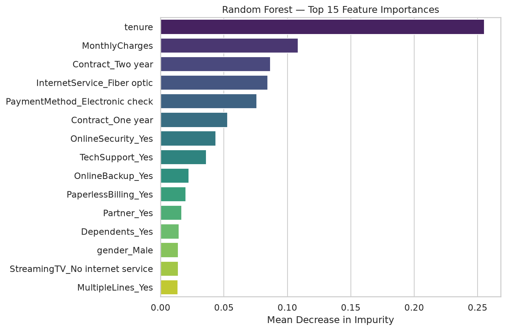

**Figure 6.** Top 15 features by mean decrease in Gini impurity. `tenure` and `Contract_Two year` are the two dominant predictors, consistent with the logistic regression.

### 3.5 RQ1 Model Comparison

| Model | Test AUROC |
|---|---|
| Logistic Regression | 0.833 |
| Lasso LR (tuned C = 0.2069) | 0.835 |
| Random Forest (tuned) | **0.836** |

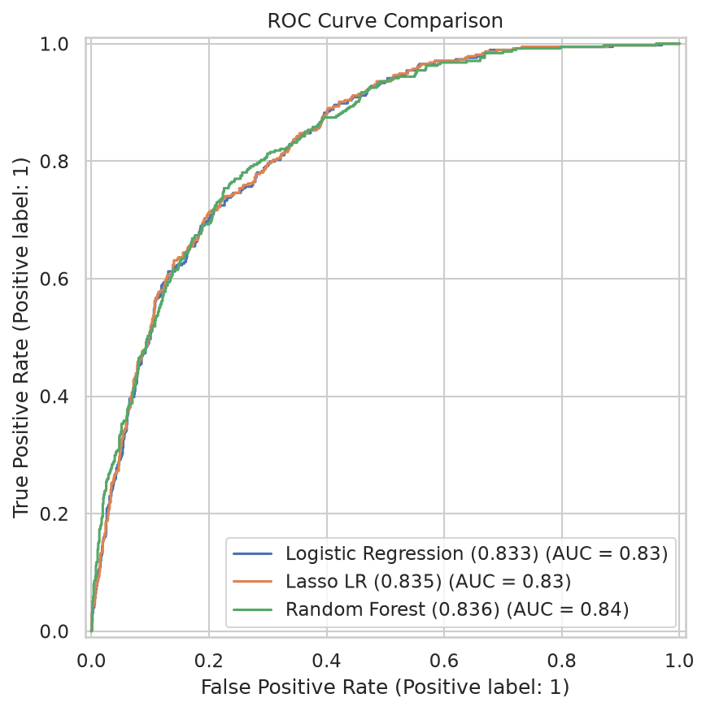

**Figure 7.** ROC curves for all three RQ1 models. Performance is nearly identical: the parametric and non-parametric models agree on the signal structure.

**RQ1 answer:** The three models converge on the same risk factors. **Contract type** (month-to-month is the dominant risk; two-year contracts are the strongest deterrent), **fiber optic internet service**, **short tenure**, **electronic check payment**, and **absence of value-added services** (especially OnlineSecurity and TechSupport) are the principal churn drivers. Retention targeting should prioritize incentivising contract upgrades and bundling security/support add-ons for new fiber customers.

---

## 4. RQ2 — Customer Segmentation & Churn Profiling

> *Do distinct customer profiles emerge from service usage and billing patterns, and do these profiles differ systematically in churn rate and revenue at risk?*

**Method sequence:** PCA reduces the encoded feature matrix to a compact representation; K-Means and Ward hierarchical clustering are compared using silhouette scores; the chosen solution is profiled by churn rate, monthly charges, tenure, and estimated customer lifetime value at risk.

### 4.1 PCA

The 7,032 × 30 (approximately) standardized and OHE-encoded matrix (using `drop='if_binary'` for unsupervised encoding) is reduced by PCA.

| PC | Explained Variance | Cumulative |
|---|---|---|
| PC1 | 28.6% | 28.6% |
| PC2 | 18.8% | 47.5% |
| PC3 | 8.2% | 55.7% |
| PC4 | 4.6% | 60.4% |
| PC5 | 3.8% | 64.2% |
| … | … | … |
| PC11 | — | ≥ 80.0% |

Eleven PCs are needed to explain 80% of variance, confirming the dataset is moderately high-dimensional. The first five PCs (64.2%) are used as the clustering space, balancing dimensionality reduction against information retention.

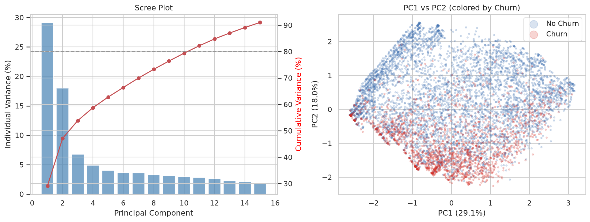

**Figure 8.** Left: scree plot — variance drops rapidly after PC2. Right: PC1 vs PC2 coloured by churn label; churners and non-churners overlap but churners cluster slightly toward higher PC1 values.

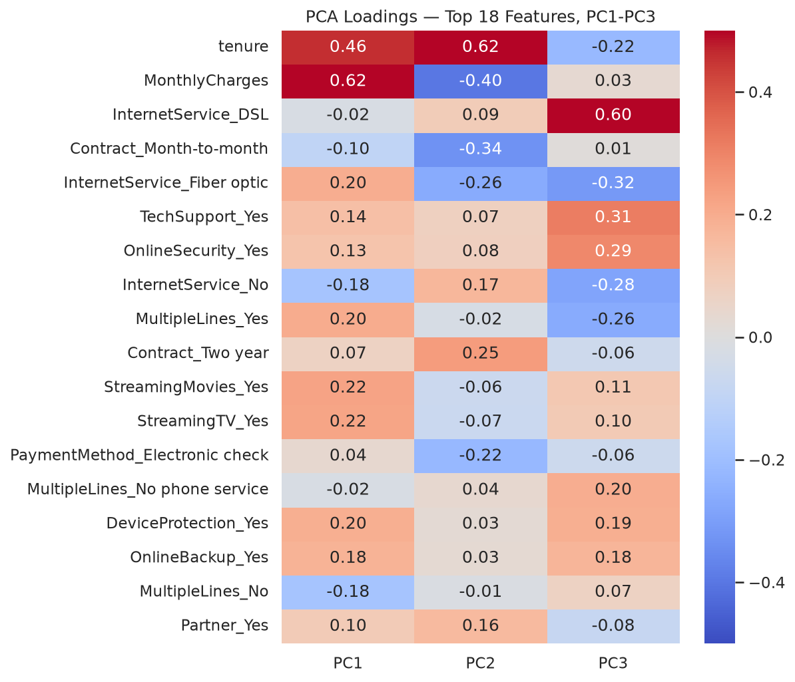

**Figure 9.** Loadings heatmap (PC1–PC3, top 18 features). PC1 is largely a "service richness" axis — customers with fiber optic and multiple add-on services score high. PC2 contrasts long-tenure / high-TotalCharges customers against recent / basic-plan customers.

### 4.2 Clustering Comparison

| Method | k | Silhouette | Cluster sizes |
|---|---|---|---|
| K-Means | 2 | **0.454** | 5512, 1520 |
| K-Means | **3** | **0.400** | 3059, 2453, 1520 |
| K-Means | 4 | 0.380 | 1987, 1984, 1541, 1520 |
| Ward HC | 2 | 0.454 | 5512, 1520 |
| Ward HC | 3 | 0.379 | 3310, 2202, 1520 |
| Ward HC | 4 | 0.350 | 2202, 1823, 1520, 1487 |

Although k = 2 yields a higher silhouette score, it merges two meaningfully different customer types into one group. K-Means k = 3 (silhouette = 0.400) is chosen because the churn profiles of the three clusters are sharply differentiated (7%, 15%, and 45%), providing actionable segmentation. Ward HC gives slightly lower silhouette scores at all k values on the PCA space.

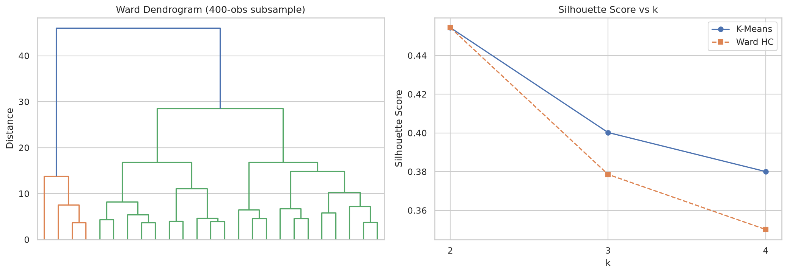

**Figure 10.** Left: Ward dendrogram on a 400-observation subsample, showing a clear three-cluster structure. Right: silhouette vs k for both methods — K-Means consistently outperforms Ward on this PCA embedding.

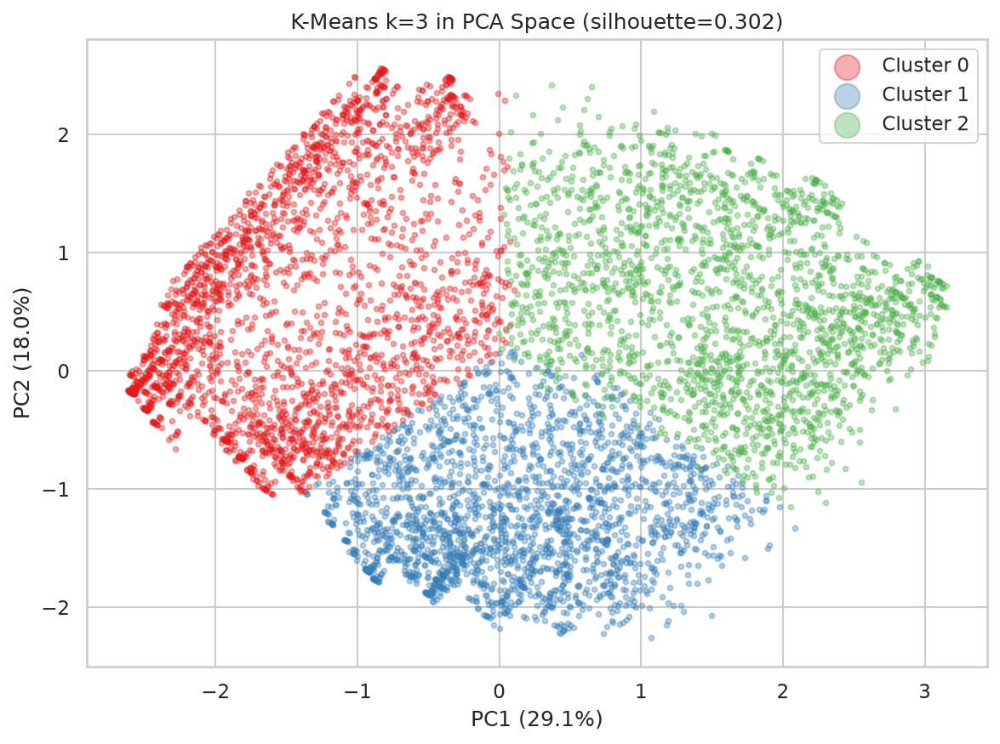

**Figure 11.** K-Means k = 3 solution in PC1–PC2 space (silhouette = 0.400). The three clusters are visually separable, especially along PC1.

### 4.3 Cluster Profiles

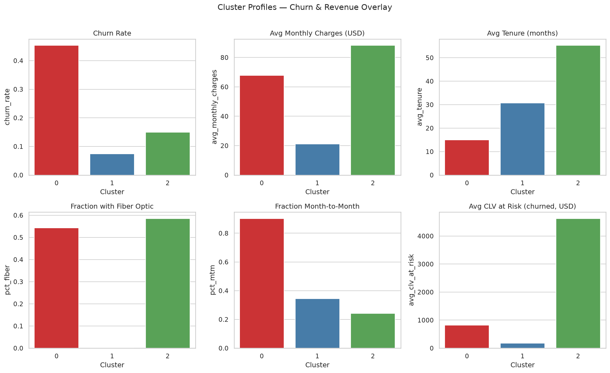

**Figure 12.** Six-panel overview: churn rate, monthly charges, tenure, fiber fraction, month-to-month fraction, and CLV at risk per cluster.

| | Cluster 0 | Cluster 1 | Cluster 2 |
|---|---|---|---|
| **n** | 3,059 | 1,520 | 2,453 |
| **Churn rate** | **45.3%** | 7.4% | 15.0% |
| **Avg monthly charges** | $67.8 | $21.1 | $88.2 |
| **Avg tenure** | 15 months | 31 months | 55 months |
| **Fiber optic** | 54.3% | 0% | 58.5% |
| **Month-to-month** | 90.2% | 34.5% | 24.2% |
| **Senior citizen** | 20.0% | 3.4% | 19.4% |
| **Avg CLV at risk (churned)** | $820 | $174 | **$4,623** |

**Cluster 0 — "New High-Risk"** (n = 3,059, churn = 45.3%): Recent customers (~15 months tenure) predominantly on month-to-month fiber contracts. The highest churn rate and largest group; priority target for contract-upgrade incentives.

**Cluster 1 — "Basic Loyal"** (n = 1,520, churn = 7.4%): Moderate-tenure customers with no internet service and low monthly charges ($21). Very low churn; low CLV at risk. Stable segment requiring only basic retention.

**Cluster 2 — "Established High-Value"** (n = 2,453, churn = 15%): Long-tenure (~55 months), high-spend ($88/mo) customers with fiber or DSL. Although churn rate is moderate, the CLV at risk ($4,623) is more than five times that of Cluster 0. Critical to retain proactively.

---

## 5. RQ3 — Service Pricing Structure

> *How much does each service add-on contribute to a customer's monthly charges, and is the pricing structure consistent and additive?*

**Method:** Ordinary Least Squares regression (statsmodels) with `MonthlyCharges` as the response. The "No internet service" and "No phone service" values in add-on columns are recoded to "No" before one-hot encoding (with `drop_first=True`) to avoid perfect collinearity with `InternetService_No`. `TotalCharges` and `Churn` are excluded. No train/test split is needed here — the goal is inferential description of the pricing schedule, not out-of-sample prediction.

### 5.1 Model Fit

**R² = 0.999**, adjusted R² = 0.999, F-statistic p < 0.001, n = 7,032.

The near-perfect R² confirms that `MonthlyCharges` is essentially a **deterministic linear function** of the subscribed services — this is a pricing schedule, not a stochastic model. The OLS here acts as a clean decomposition tool.

### 5.2 Service Contribution Table

All coefficients are significant at p < 0.001 except the two Contract terms.

| Service | Estimated contribution (USD) | 95% CI | p-value |
|---|---|---|---|
| Intercept (DSL, no phone, no add-ons) | 24.95 | [24.86, 25.03] | < 0.001 |
| Fiber optic (vs DSL) | +24.95 | [24.89, 25.02] | < 0.001 |
| No internet (vs DSL) | −25.04 | [−25.14, −24.95] | < 0.001 |
| Phone service | +20.06 | [19.96, 20.15] | < 0.001 |
| Streaming TV | +9.97 | [9.90, 10.03] | < 0.001 |
| Streaming Movies | +9.96 | [9.90, 10.03] | < 0.001 |
| Tech Support | +5.03 | [4.97, 5.10] | < 0.001 |
| Device Protection | +5.02 | [4.96, 5.08] | < 0.001 |
| Multiple Lines | +5.02 | [4.96, 5.07] | < 0.001 |
| Online Security | +5.01 | [4.95, 5.08] | < 0.001 |
| Online Backup | +4.99 | [4.94, 5.05] | < 0.001 |
| Contract One year (vs MTM) | +0.01 | [−0.05, 0.08] | 0.714 |
| Contract Two year (vs MTM) | −0.02 | [−0.10, 0.05] | 0.539 |

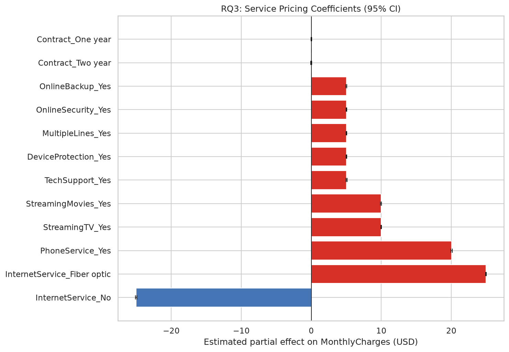

**Figure 13.** OLS coefficient plot with 95% confidence intervals. All service coefficients are precisely estimated (narrow CIs due to the nearly deterministic pricing structure). Contract terms are indistinguishable from zero.

### 5.3 Regression Diagnostics

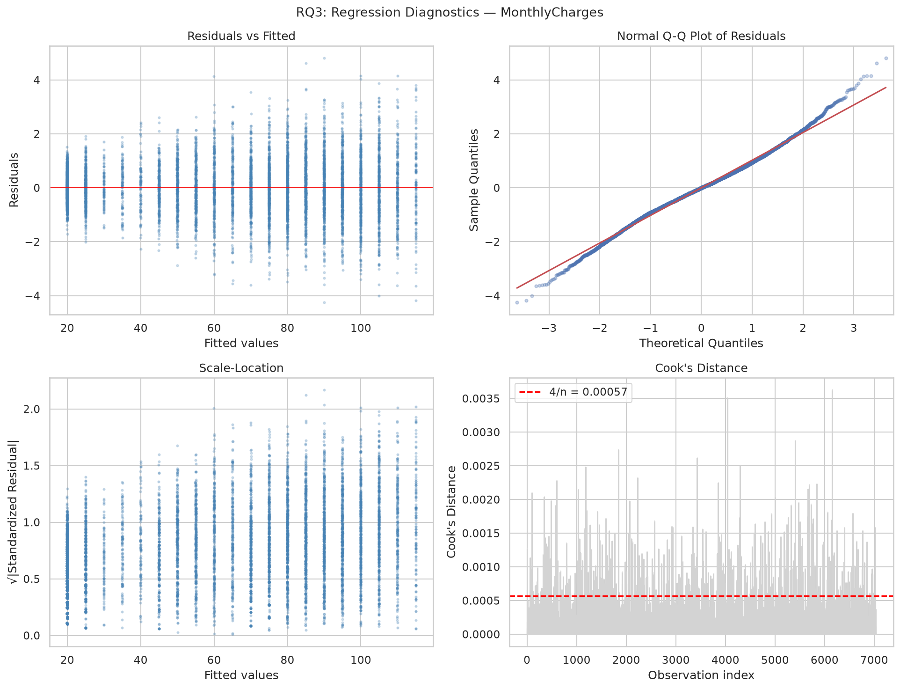

**Figure 14.** Diagnostic plots. The residuals-vs-fitted and scale-location panels show very small but non-random residuals (residual SD ≈ 0.5 USD), reflecting minor rounding or promotional pricing that the additive model cannot capture. The Q-Q plot confirms approximate normality of residuals. 474 observations (6.7%) exceed the Cook's D threshold of 4/n = 0.00057 — a consequence of the extremely small threshold for large n; no observation is truly influential at practical significance levels.

**RQ3 answer:** Monthly charges decompose almost perfectly into a transparent additive pricing schedule. Each streaming service adds ~$10; security, backup, device protection, and tech support each add ~$5; phone service adds ~$20; fiber optic adds ~$25 over the DSL baseline. Crucially, **contract length does not affect monthly charges** (both contract coefficients are near zero and non-significant), confirming that contract type governs *commitment* rather than price level.

---

## 6. RQ4 — Decision Tree & Gradient Boosting

> *Can tree-based interpretable methods reveal the decision logic behind churn, and how do they compare to linear classifiers on predictive performance?*

**Method:** A shallow Decision Tree (max_depth = 3) provides a human-readable set of decision rules. A CV-tuned Decision Tree and a Gradient Boosting ensemble extend this to competitive predictive performance. All use the same preprocessing pipeline and train/test split as RQ1.

### 6.1 Shallow Decision Tree — Interpretable Rules

Depth-3 tree (test AUROC = 0.810):

```
|--- tenure ≤ −0.65  [raw: ≤ ~16 months]
|   |--- InternetService_Fiber optic ≤ 0.5  (no fiber)
|   |   └── Predict: No Churn
|   |--- InternetService_Fiber optic > 0.5  (fiber optic)
|   |   └── Predict: Churn
|--- tenure > −0.65  [raw: > ~16 months]
|   |--- InternetService_Fiber optic ≤ 0.5  (no fiber)
|   |   └── Predict: No Churn
|   |--- InternetService_Fiber optic > 0.5  (fiber optic)
|   |   |--- tenure ≤ 0.93  [raw: ≤ ~55 months]
|   |   |   └── Predict: No Churn
|   |   |--- tenure > 0.93  [raw: > ~55 months]
|   |   |   └── Predict: No Churn
```

*(Standardized thresholds translated using training-set mean = 32.42 months, SD = 24.55 months.)*

The tree essentially distils to a **single dominant rule**: customers who are **new (≤ 16 months) AND on fiber optic** are predicted to churn. All other customer profiles are predicted to stay. This aligns perfectly with the Lasso coefficients and the Cluster 0 profile from RQ2 — the high-risk segment is precisely this intersection.

### 6.2 Tuned Decision Tree & Gradient Boosting

| Model | Best hyperparameters | Test AUROC |
|---|---|---|
| Shallow DT (depth = 3) | fixed | 0.810 |
| Tuned DT | max_depth = 6, min_samples_leaf = 40 | 0.829 |
| Gradient Boosting | lr = 0.05, max_depth = 2, subsample = 0.8 | **0.840** |

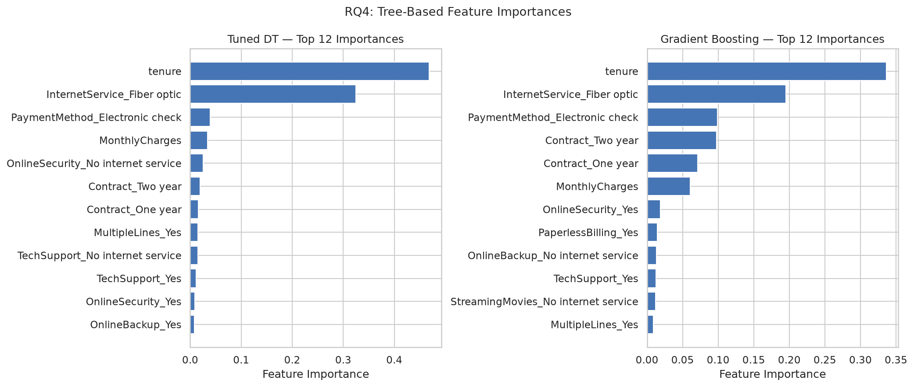

**Figure 15.** Feature importances (Gini decrease) for the tuned DT (left) and GB (right). Both identify `tenure` and `InternetService_Fiber optic` as the two dominant predictors, confirming the findings from RQ1 and the shallow tree rules.

### 6.3 All-Model Comparison

| Model | Test AUROC |
|---|---|
| Decision Tree (tuned) | 0.829 |
| Logistic Regression | 0.833 |
| Lasso LR (tuned) | 0.835 |
| Random Forest (tuned) | 0.836 |
| **Gradient Boosting** | **0.840** |

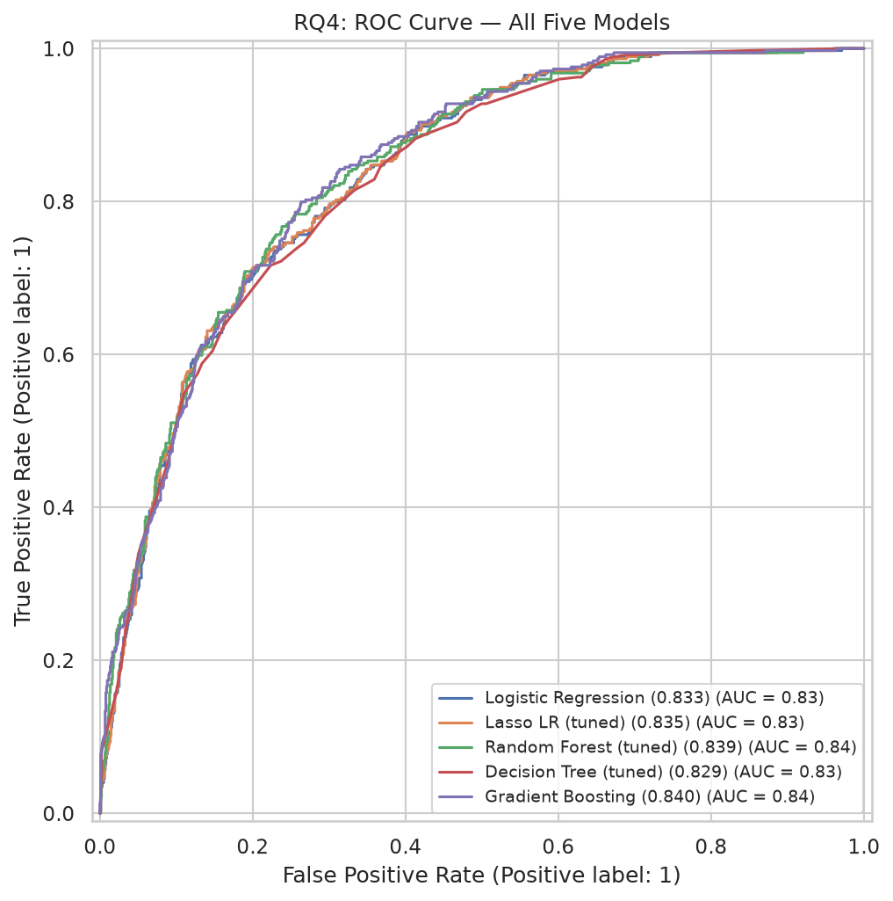

**Figure 16.** ROC curves for all five models. Gradient Boosting achieves the highest AUROC (0.840), but the margin over logistic regression (0.833) is modest — a 0.7 percentage point difference — suggesting the churn signal is well-captured by linear combinations of features. The tree-based methods add marginal predictive value rather than revealing qualitatively different structure.

**RQ4 answer:** The shallow DT confirms that churn is primarily driven by the **new-customer × fiber optic interaction**. Gradient Boosting achieves the best AUROC (0.840) among all models, but the improvement over logistic regression is small, indicating that the feature-outcome relationship is largely linear on the log-odds scale. For operational deployment, logistic regression or Lasso offers a better interpretability–performance tradeoff; GB would be preferred if the 0.7pp AUROC gain translates into meaningful business value.

---

## 7. RQ5 — Probabilistic Segmentation with GMM

> *Do customers exhibit soft, probabilistic membership in latent segments, and does a GMM at higher granularity uncover finer-grained risk profiles than the K-Means solution?*

**Method:** Gaussian Mixture Models (GMM) with full covariance matrices, fitted on the same PCA-5 space as RQ2. BIC and AIC model selection over k = 2, …, 6. `n_init = 10` restarts guard against local optima. Soft posterior probabilities from `predict_proba()` are used to identify uncertain memberships.

### 7.1 Model Selection

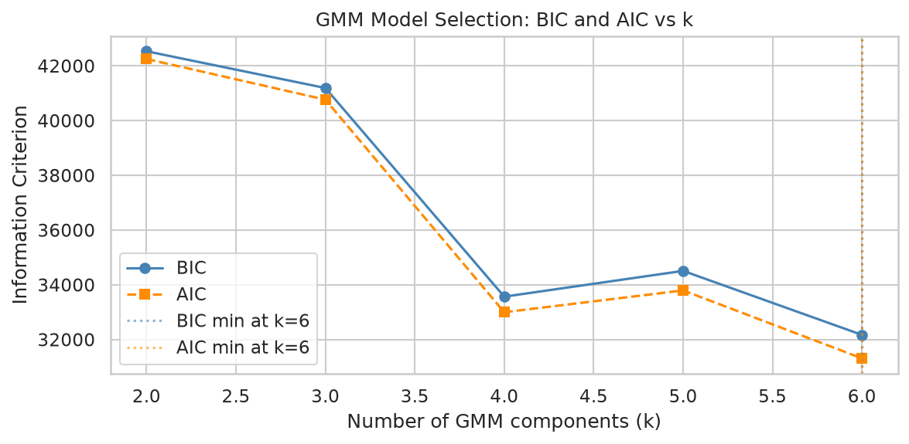

**Figure 17.** BIC and AIC as a function of k. Both criteria select **k = 6**, indicating that a six-component model provides the best balance between fit and complexity. BIC penalizes model complexity more heavily than AIC but both agree here.

### 7.2 Soft Memberships and Uncertainty

**k = 6 GMM** summary:
- **5.7% of customers** have maximum posterior probability < 0.80 (uncertain members)
- **Mean posterior certainty = 0.967** (SD = 0.083): the vast majority of customers are clearly assigned to one component
- **Adjusted Rand Index vs K-Means k = 3: 0.330** — moderate agreement, expected given the different number of components

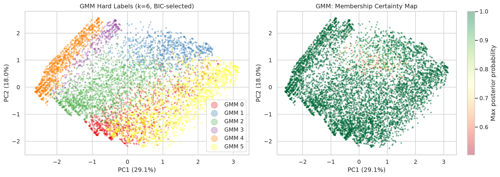

**Figure 18.** Left: GMM hard labels (MAP assignment) in PC1–PC2 space. Right: colour-coded membership certainty — uncertain customers (yellow) appear mainly at cluster boundaries.

### 7.3 GMM Component Profiles

| Component | n | Churn Rate | Avg Monthly | Avg Tenure | Fiber | MTM | Profile |
|---|---|---|---|---|---|---|---|
| **C1** | 901 | **66.3%** | $80 | 10 mo | 100% | 99.8% | New fiber MTM — critical risk |
| C3 | 428 | 40.0% | $43 | 7 mo | 0% | 100% | New basic MTM — moderate risk |
| C5 | 747 | 34.7% | $91 | 30 mo | 100% | 64% | Mid-tenure fiber — elevated risk |
| C0 | 1,439 | 30.6% | $99 | 49 mo | 100% | 52% | Long-tenure fiber — moderate risk |
| C4 | 1,997 | 14.4% | $62 | 39 mo | 0.5% | 40% | Mid-tenure DSL — low risk |
| **C2** | 1,520 | **7.4%** | $21 | 31 mo | 0% | 35% | Basic no-internet — very low risk |

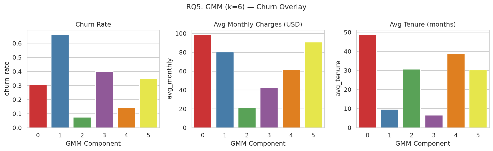

**Figure 19.** Churn rate, monthly charges, and tenure by GMM component. Component 1 (new fiber MTM) stands out with a 66.3% churn rate — the highest of all clusters across both RQ2 and RQ5.

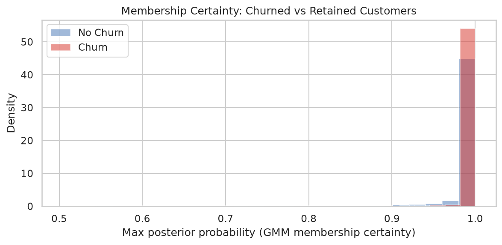

**Figure 20.** Distribution of maximum posterior probabilities for churned vs retained customers. Churned customers show a heavier tail of uncertain membership (lower certainty), consistent with the idea that at-risk customers straddle multiple behavioural profiles.

**RQ5 answer:** GMM at k = 6 reveals finer structure than the K-Means k = 3 solution. The highest-risk segment (C1, churn = 66.3%) precisely identifies **new fiber customers on month-to-month plans**, with virtually no variation in contract type. The GMM adds value by further decomposing the long-tenure fiber segment (C0 vs C5) and distinguishing basic-service new customers (C3) from the lowest-risk basic/no-internet segment (C2). The moderate ARI (0.330) against K-Means shows that GMM captures genuinely different structure at higher granularity.

---

## 8. Conclusions & Limitations

### 8.1 Summary of Findings

| RQ | Key Finding |
|---|---|
| **RQ1** | Contract type and tenure are the strongest churn predictors. Two-year contracts reduce churn odds by the largest margin. Fiber optic internet is the top positive risk factor. Gradient Boosting achieves the best AUROC (0.840); all five models agree on the risk factor ranking. |
| **RQ2** | K-Means k = 3 identifies three actionable segments: "New High-Risk" (Cluster 0, 45% churn), "Basic Loyal" (Cluster 1, 7% churn), and "Established High-Value" (Cluster 2, 15% churn, $4,623 CLV at risk). |
| **RQ3** | Monthly charges are an almost perfectly additive pricing schedule (R² = 0.999). Each add-on service contributes a fixed, precisely estimated amount. Contract length does not affect the monthly price. |
| **RQ4** | The shallow DT distils the entire churn signal into one rule: new customers (≤16 months) on fiber optic churn. Gradient Boosting tops the leaderboard (AUROC = 0.840); the marginal gain over logistic regression is modest. |
| **RQ5** | GMM at k = 6 provides soft probabilistic assignments. The highest-risk GMM component (C1) achieves a 66.3% churn rate — new fiber MTM customers. Uncertain membership concentrates among churners. |

### 8.2 Limitations

1. **No causal claims.** All findings are associations from observational cross-sectional data. The fact that fiber optic customers churn more does not imply that fiber causes churn — confounding factors (e.g., competitive alternatives, geographic market) are unobserved.

2. **Class imbalance.** With 26.6% churn, classifiers optimized for accuracy would tend to suppress the minority class. We use `class_weight='balanced'` for logistic regression and report AUROC (threshold-free). Future work could apply SMOTE or cost-sensitive learning more systematically.

3. **TotalCharges excluded.** Near-perfect collinearity (r = 0.9996) with `tenure × MonthlyCharges` requires exclusion from models. This means the long-run revenue dimension is not directly used as a predictor.

4. **Clustering sensitivity.** Silhouette scores are computed in the PCA-5 space, not the original feature space. Different distance metrics or preprocessing choices could shift the optimal k. The k = 3 solution is preferred on substantive grounds (distinct churn profiles), not solely on silhouette.

5. **Temporal structure ignored.** Tenure is treated as a static snapshot. Customer behaviour likely evolves over time; a survival analysis or longitudinal panel model would better capture the temporal dynamics of churn.

---

*All analysis is performed in Python 3.14 using scikit-learn, statsmodels, matplotlib, and seaborn. The full reproducible notebook is available at `main.ipynb`.*
